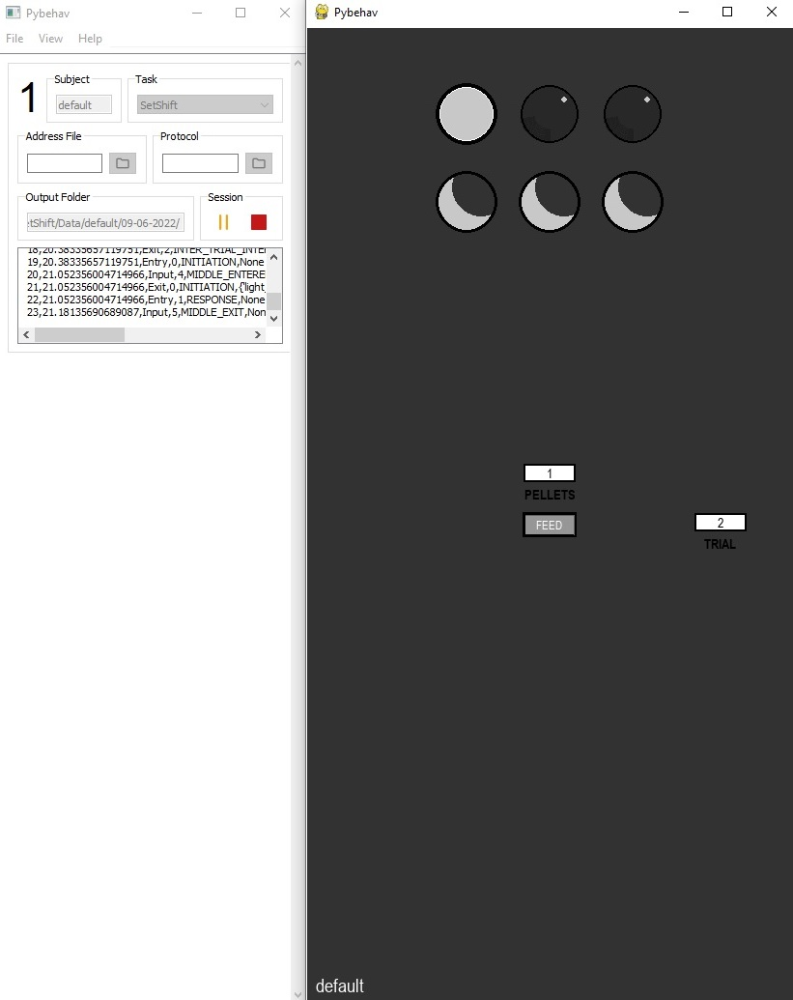

<h3 align="center">pybehave</h3>

<div align="center">
<a href="https://github.com/tne-lab/py-behav-box-v2">
    
  </a>
</div>

<p align="center">
A hardware-agnostic, Python-based framework for developing behavioral neuroscience experiments
<br />
<a href="https://py-behav-box-v2.readthedocs.io/en/latest/"><strong>Explore the docs »</strong></a>
<br />
<br />
<a href="https://github.com/tne-lab/py-behav-box-v2/issues">Report Bug</a>
·
<a href="https://github.com/tne-lab/py-behav-box-v2/issues">Request Feature</a>
</p>

## Overview

Pybehave is an open-source software interface and framework designed for controlling behavioral experiments in neuroscience and psychology. It is built around a hardware-agnostic and highly object-oriented design philosophy, allowing for flexible and scalable experiment control.

The /tests directory contains a comprehensive suite of Unit Tests and Integration Tests designed to verify the core logic, Inter-Process Communication (IPC), and hardware-simulated paths.

## Technical Stack
These tests leverage standard Python testing libraries to ensure reliability:

1. Pytest: Primary test runner and framework.

2. Unittest / Mock: Used for behavioral verification and isolating components.

3. msgspec: For validating serialized data over IPC pipes.

## Getting Started
### Prerequisites
Ensure you are using the dedicated Conda environment and have the required Python testing libraries installed:

```bash
conda activate Pybehave
```
### Execution:
Pytest automatically discovers tests. To run the entire suite with detailed output:

1. Choose Your Test Type

```bash
cd path/to/UnitTestFolder
```
or 

```bash
cd path/to/IntegrationTestFolder
```
2. Run all tests within the folder:

```bash
pytest -v
```

To isolate a specific unit or integration test, pass the filename as an argument:

```bash
# Example: Running a specific test file
pytest test_taskprocess_ipc.py -v
```

### Example Output:
When the tests run successfully, your terminal should look like this:

=========================== test session starts ============================

platform win32 -- Python 3.9.x, pytest-7.x.x
rootdir: C:\Users\YourName\Project
collected 3 items

test_task_logic.py::test_task_initialization PASSED                  [ 33%]
test_task_logic.py::test_taskprocess_ipc_path PASSED                 [ 66%]
test_integration.py::test_tpq_event_handling PASSED              [100%]

============================ 3 passed in 4.52s =============================
