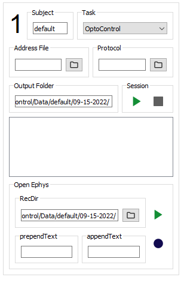

# Logging events

## Overview

Pybehave's event framework formalizes the process of exporting [task](tasks.md) data to external systems like the console, file system, 
or across a network. As opposed to [Sources](sources.md) which control task [Components](components.md), events are intended solely for logging purposes
and saving data from the task. Towards this end, each task can be associated with any number of *EventLoggers* that are written
to parse certain types of *Events*.

## Event objects

All events subclass the base *Event* class which only requires the task and optional metadata for construction and records the
time of creation based on the task's `cur_time` attribute. This class is heavily subclassed to represent numerous possible 
types of Events that could be required by various tasks or external systems. 

### Core events

While events can be customized for specific needs, there are a few default Event classes that can represent the majority
of task information across systems. When the task begins, the state changes, and the task ends three types of events will be logged:
`InitialStateEvents`, `StateChangeEvents`, or `FinalStateEvents`. These three classes have additional attributes for the specific
states they are associated with. Additionally, `InputEvents` can be used to capture inputs to the task from components and
have an additional attribute to represent the input state.

## EventLoggers

EventLoggers ingest Task events to complete desired tasks. The core method of the EventLogger class, `log_events` will receive
the list of events logged by its corresponding task in the last iteration of `main_loop`. All EventLoggers will receive the full
list of events which will only be cleared after all loggers have executed their `log_events` methods. Different logic cases
can be written in the method to ensure EventLoggers only capture events of interest and vary behavior based on the *Event* subclass.
For example, the `OENetworkLogger` class has a case for handling `OEEvents` while all other EventLoggers do not.
An example `log_events` override for the core event types is shown below:

    def log_events(self, events):
        for e in events:
            self.event_count += 1
            if isinstance(e, InitialStateEvent):
                # Log for InitialStateEvent
            elif isinstance(e, FinalStateEvent):
                # Log for FinalStateEvent
            elif isinstance(e, StateChangeEvent):
                # Log for end of prior state
                self.event_count += 1
                # Log for beginning of new state
            elif isinstance(e, InputEvent):
                # Log for InputEvent
        super().log_events(events)  # Sometimes the super class method should be called

All EventLoggers have an `event_count` attribute for tracking the number of events that have been handled by the logger.
Additional EventLogger arguments for particular subclasses can be provided when added to the [Workstation](workstation.md).

### start and close

The EventLogger class also provides two additional methods that will be called when the task begins and ends: `start` and `close`.
These methods do not have to be overridden but the `start` method will reset `event_count` each time it is called.

### FileEventLoggers

FileEventLogger is a subclass of EventLogger with additional functionality for handling file saving. The `start` and `close`
methods of FileEventLogger ensure that files are opened and closed when needed. Additionally, the `log_events` method will flush
the file regularly if called by its subclass. To use a FileEventLogger, the user needs to override the `get_file_path`method
which will return the path to the file that should be saved. This path will then be used to open a file stored in the `log_file`
attribute. FileEventLoggers will default to saving to the *Desktop/py-behav-v2/TASK_NAME/Data/SUBJECT_NAME/DATE* folder which
is represented in the class by the `output_folder` attribute. An example override of `get_file_path` used by CSVEventLogger is shown below:

    def get_file_path(self):
        return "{}{}.csv".format(self.output_folder, math.floor(time.time() * 1000))

### GUIEventLoggers

GUIEventLogger is a subclass of EventLogger that allows additional widgets to be added to the *ChamberWidget* in the Workstation.
These widgets allow for user control of EventLoggers should it be necessary for starting/stopping external systems
or manual entry. GUIEventLoggers have two additional methods: `set_chamber` and `get_widget`. The `set_chamber`
method is called when the logger is associate with a particular Workstation chamber and the `get_widget` method should
return a [PyQt5](https://www.riverbankcomputing.com/static/Docs/PyQt5/) object (typically a *QGroupBox*) that will be added
to the *ChamberWidget*. An example of such a widget for the *OENetworkLogger* class is shown below:

