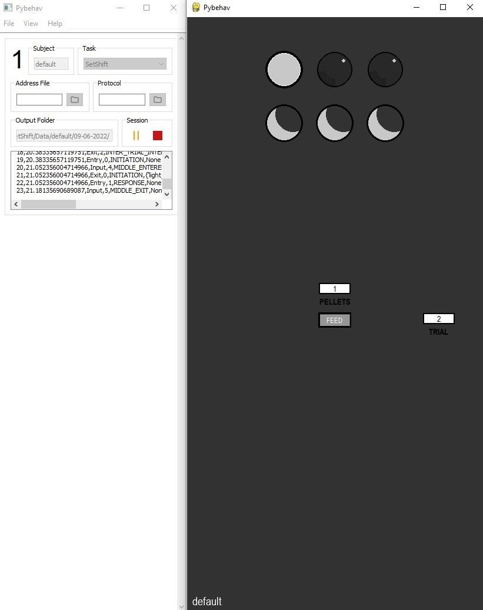

# Home

## Overview

Pybehave is an open source software interface and framework for controlling behavioral experiments in neuroscience and psychology
built around a hardware-agnostic and highly object-oriented design philosophy.

Pybehave separates code for task design from specific hardware implementations to streamline development, accessibility, and
data sharing. This approach, combined with a task-specific Graphical User Interfaces (GUIs), expedites and simplifies the creation and visualization of complex behavioral tasks.
User created [task](tasks.md) definition files can interact with hardware-specific [Source](sources.md) files both written in Python. Any and all local
configuration can be handled outside of Python using [Address Files](protocols_addressfiles.md#addressfiles) and [Protocols](protocols_addressfiles.md#protocols).

All pybehave tasks are coordinated via a [Workstation](workstation.md) GUI.

Pybehave software and documentation are available on [GitHub](https://github.com/tne-lab/py-behav-box-v2).

## Getting started

While pybehave is in principle cross-platform, it has only been extensively tested on Windows. We are happy to support 
other platforms so log any issues on GitHub if you have trouble installing. Additionally, some Sources are unlikely to work
on all platforms.

### Install with pip

We recommend installing pybehave in a virtual environment. Pybehave has been tested on Python 3.9, 3.10, and 3.11.

Install pybehave's default [PYPI distribution](https://pypi.org/project/pybehave/) with

    pip install pybehave

This distribution does not include any of the dependencies for hardware specific functionality. To install the dependencies
for all supported hardware use the following

    pip install pybehave[full]

Alternatively, a subset of the dependencies can be downloaded, for example

    pip install pybehave[oe,video]

A full list of the optional hardware-specific extras is below

    oe              # Dependencies for the OpenEphys framework
    whisker         # Dependencies for communication with WhiskerServer
    video           # Dependencies for control of connected video systems
    serial          # Dependencies for communication over serial
    ni              # Dependencies for communication with NationalInstruments DAQs
    hikvision       # Dependencies for communication with HikVision DVRs
    bo              # Dependencies for a Bayesian Optimization framework

### Run from source

Alternatively, you can clone the repository and run from source.

    git clone https://github.com/tnelab/py-behav-box-v2.git
    cd py-behav-box-v2
    pip install .

Hardware-specific extras can be installed by adding square brackets after the '.' similarly to the above.

### Starting pybehave

From the standard install, pybehave can be started by running the `pybehave` command from the virtual environment. Alternatively,
if you have installed pybehave into a conda environment on Windows, we've provided an example batch script for starting pybehave in the root 
directory (py-behav.bat). This batch script can be copied to the Desktop and the first line should be modified to use the name
of the environment where pybehave was installed. This batch file will also redirect all console outputs to a log file in the
*py-behav/logging* directory.

### Local folder structure

Pybehave uses a folder saved on the Desktop to handle all task files and local configuration:

    -py-behav
        pybehave.ini            # Contains all settings for the GUI
        -Local
            -Tasks              # Task python files
            -GUIs               # Task GUI files
            -Sources            # User-created sources
        -Configurations         # Structured CSVs for quickly loading tasks
        -TaskName1              # All files associated with a Task called TaskName1
            -AddressFiles       # AddressFiles for this task
            -Protocols          # Protocols for this task
            -Data               # Any data associated with runs of the task
        -TaskName2          

We've included an example set of [task files](https://github.com/tne-lab/example-tasks) used by Translational Neuroengineering Lab. 
If you plan to edit or add tasks, you should make a new repository with the same structure (Tasks and GUIs folders) and 
include any existing tasks you might need. The contents of this repository should be saved in the Local directory.

### Updating pybehave

Pybehave is explicitly designed in a manner where files for local configuration are separate from the root directory. This
ensures that users can easily update to the newest version of the platform without compromising their experimental files. 
To update, simply pull the latest version from the upstream base pybehave code repository and the repository referenced by
the *Local* folder.

### Running a task

After opening pybehave, you will see a GUI window like that shown above.

Select *File->Add Task* from the menu bar. Choose your [task](tasks.md) and a chamber number from the dropdowns or load a [Configuration](workstation.md#configurations) file.

Enter a subject ID in the *Subject* text box and choose an [Address File](protocols_addressfiles.md#addressfiles) or [Protocol](protocols_addressfiles.md#protocols) if necessary to set up the local configuration of the task.

Any [event](events.md) information such as data saving or external communication or pre-task prompts can be configured by right-clicking the chamber widget
and selecting *Edit Configuration*. All data will be saved to the Desktop in the *py-behav/TASK_NAME/Data/SUBJECT/DATE* folder.

Press the green play button to start the task.

The task can be paused or ended prematurely with the orange pause button or red stop button respectively.

## Contributing, Questions, Issues, and Feedback

Users interested in expanding functionalities in pybehave are welcome to do so. Issues reports are encouraged through GitHub's [issue tracker](https://github.com/tne-lab/py-behav-box-v2/issues). 
See details on how to contribute and report issues in [CONTRIBUTING.md](https://github.com/tne-lab/py-behav-box-v2/blob/master/CONTRIBUTING.md).