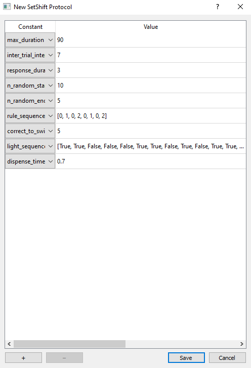
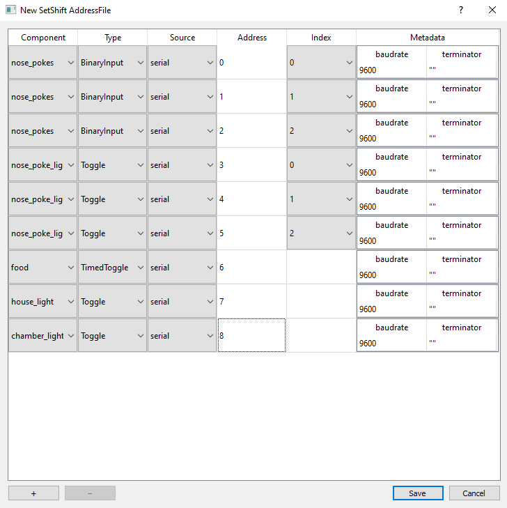

# Local configuration with Protocols and AddressFiles

## Overview

Pybehave allows users to alter task functionality through two types of local Python files that can be loaded at runtime: Protocols and AddressFiles. 
Protocols can be processed to override default values for task constants. These constants can be used
to control a variety of task behavior including trial timing and order, types of trials to include, or general rules for 
task progression. Together, constants reduce the number of similar tasks that have to be written and simplify basic variation
in tasks. AddressFiles indicate which [Sources](sources.md) are related to each [Component](components.md), any necessary hardware
addresses, and optional metadata. AddressFiles simplify the process of running the same task on a variety of hardware without
editing the underlying task files.

## Protocols

Protocols are executed at runtime to modify task constants. Tasks can have any number of protocols
to alter all or a subset of constants. Protocols can define any necessary imports, variables, or functions; the only
requirement is that they define a dictionary called `protocol`. Each item in `protocol` must correspond to a constant defined
by the task's `get_constants` method with a new value to replace the pre-existing one. An example protocol is shown below:

    import math

    protocol = {'inter_trial_interval': 3,
            'response_duration': 6,
            'reward_amount': 3**2*math.pi}

Protocols can be loaded from any directory, but we recommend saving them at *Desktop/py-behav-v2/TASK_NAME/Protocols*.

### Protocol Creation GUI

Instead of manually creating Protocols, Protocols can also be created using a GUI tool by going to File->Protocols->New/Edit.
From here, you can select which Task you want to create a Protocol for. In the creation GUI, constants can be added or removed
from the Protocol with the corresponding buttons in the bottom-left of the interface. When a constant is added, the GUI
will default to selecting one of the available entries and autopopulate it with the default value from the `get_constants`
method. The chosen constant can be changed in the corresponding Constant dropdown. If the constant's default value is an expression,
the expression will be evaluated and set as the default value.

## AddressFiles

AddressFiles are executed at runtime to associate *Components* with particular *Sources*. Tasks can have any number of AddressFiles
to associate all or a subset of components with particular hardware. AddressFiles can define any necessary imports, variables, or functions; the only
requirement is that they define an *AddressFile* object called `addresses`. *Components* can then be added to the object by its
`add_component` method:

    addresses = AddressFile()
    addresses.add_component("nose_pokes", "BinaryInput", "es", 3, 0)
    addresses.add_component("nose_pokes", "BinaryInput", "es", 2, 1)
    addresses.add_component("nose_pokes", "BinaryInput", "es", 1, 2)
    addresses.add_component("nose_poke_lights", "Toggle", "es", 10, 0)
    addresses.add_component("nose_poke_lights", "Toggle", "es", 15, 1)
    addresses.add_component("nose_poke_lights", "Toggle", "es", 2, 2)
    addresses.add_component("food", "TimedToggle", "es", 5)
    addresses.add_component("house_light", "Toggle", "es", 8)
    addresses.add_component("video", "Video", "es", 9, None, {"fr": 30})

The `add_component` method has four required arguments and two optional ones. The first, `component_id` is the component's ID
and should correspond to one of the entries in the Task's `get_components` method. The second, `component_type` is the component's
type and must correspond to a class in a module of the same name in the *sources/Components* folder. The third, `source_name`
is the identifier that was given to the [Source](sources.md) this component should be associated with. The fourth, `component_address`,
is the hardware address the source should associate this component with. The first of the two optional arguments, `list_index` 
indicates the component's list position if the ID is associated with a list of components. The second optional argument, `metadata`
is a dictionary that can be used to override Component attributes (analogous to a Protocol for components). AddressFiles can be 
loaded from any directory, but we recommend saving them at *Desktop/py-behav-v2/TASK_NAME/AddressFiles*.

### AddressFile Creation GUI

Instead of manually creating AddressFiles, AddressFiles can also be created using a GUI tool by going to File->AddressFiless->New/Edit.
From here, you can select which Task you want to create an AddressFile for. In the creation GUI, components can be added or removed
from the AddressFile with the corresponding buttons in the bottom-left of the interface. When a component is added, the GUI
will default to selecting one of the available entries and autopopulate it according to the `get_components`
method. The chosen component can be changed in the corresponding Component dropdown. The type of the component can be changed
in the Type dropdown and will automatically be restricted to valid options. The Source linked to the component can be changed 
in the Source dropdown and will include possible entries for all Sources configured in the system. The component address can
be changed in the Address field; valid addresses must be strings, integers, floats, or list of the aforementioned options.
If the component is part of a list, the component index in the list can be selected from the Index dropdown. Lastly, any metadata
required for this component by the linked Source or the Component class itself will automatically be indicated in the Metdata
field. Default values for metadata are indicated in the corresponding Source or Component class.

