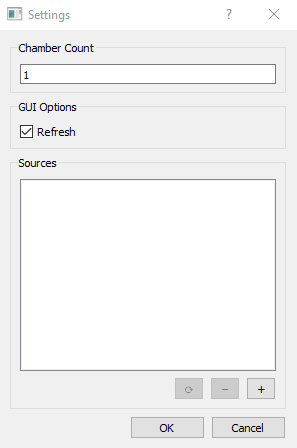

# Running a task on hardware

In the following, we will show how to set up the workstation to run a task on
operant hardware. This is not a complete overview of all possible configuration
but will guide you through adding Sources to the Workstation and creating new
AddressFiles and Protocols for local configuration.

## Example task

For this tutorial we will be setting up the Workstation to run a simple bar 
press task where a rodent needs to press a bar to receive a pellet reward. In
the TNEL, we run this task using hardware developed by Lafayette Instruments 
and communicate with the chamber using the Whisker Server. Additionally, we 
simultaneously record video during the task via a webcam.

## Adding Sources to the Workstation

Without Sources, tasks can only interact with the GUI itself. To connect to our
hardware, we need to link the hardware to the Workstation by adding Sources.
This only needs to be done once whenever new hardware is needed by the system.
Sources can be added by going to File->Settings to open the SettingsDialog.

Available Sources are indicated by the list. If the Workstation has more than one chamber, the count
variable can also be set accordingly in settings. For this tutorial we will be adding a WhiskerLineSource to communicate with the 
digital inputs and outputs in the operant chamber and a VideoSource to control
the webcam. To add a Source, press the "+" button to bring up the AddSourceDialog.

Available Sources can be selected from the dropdown and named via the upper
textbox. For this Whisker-based task, we will be adding a WhiskerLineSource named "whisker"
and a VideoSource named "video".
The names are arbitrary but will be referred to later when making the AddressFile.
Some Sources might require more parameters to 
set up. If so, a second Dialog, the SourceParametersDialog, will pop up. Examples are shown below
for the WhiskerLineSource (left) and VideoSource (right):

## Creating an AddressFile

The AddressFile will be used to link each Task component to the corresponding Source. Each 
AddressFile will begin with the creation of an AddressFile object named addresses:

    addresses = AddressFile()

Each Component with a corresponding hardware address should be added to the AddressFile via
the add_component method. This method takes four primary arguments: the name of the component
corresponding to an entry in the Task get_constants method, the type of class for the component,
the name given to the corresponding Source, and the address related to this Component. If the 
Component is part of a list, an additional fifth argument should be provided for the position in 
the list. Lastly, an additional sixth argument can be provided with a dictionary containing
any metadata the Component might need. For the simple bar press task, we will reference the following
get_components declaration:

    def get_components():
        return {
            'food_lever': [BinaryInput],
            'cage_light': [Toggle],
            'food': [TimedToggle],
            'fan': [Toggle],
            'lever_out': [Toggle],
            'food_light': [Toggle],
            'cam': [Video]
        }

This can then be used as a reference for the names and object types for an AddressFile like the
one below:

    addresses.add_component("food_lever", "BinaryInput", "whisker", "14")
    addresses.add_component("cage_light", "Toggle", "whisker", "15")
    addresses.add_component("food", "TimedToggle", "whisker", "16")
    addresses.add_component("fan", "Toggle", "whisker", "17")
    addresses.add_component("lever_out", "Toggle", "whisker", "18")
    addresses.add_component("food_light", "Toggle", "whisker", "19")
    addresses.add_component("cam", "Video", "video", "0", None, {"fr": 30})

## Creating a Protocol

For this Task, we typically use two different protocols: one where the rats can always press for 
an award and a second where rats will be locked out from receiving an award after making a press
for a set duration. This difference is coded in the task based on a boolean constant called 
reward_lockout which defaults to False. If we want to add a protocol for the lockout version we would
create a new Python file which defines a protocol dictionary that overrides one of the entries in the Task's
get_constants method:

    def get_constants():
        return {
            'duration': 40,
            'reward_lockout': False,
            'reward_lockout_min': 25,
            'reward_lockout_max': 35,
            'dispense_time': 0.7
        }

These entries can then be used as a reference for the override in a Protocol file like the one below:

    protocol = {"reward_lockout": True}

## Adding a Task

To run a Task, it needs to be associated with one of the Workstation's chambers. This can be done
by going to File->Add Task to open the corresponding dialog.

The desired task can be selected from the dropdown along with the chamber it should be associated
with. A task can also be loaded from a configuration file which we will create in the next few
steps. Once the Task is added, a corresponding ChamberWidget will appear in the GUI:

## Creating the Configuration

Now that the Task has been added to the GUI, we can create a configuration that links the 
AddressFile, Protocol, and other desired information. The subject can be changed by editing the
Subject text field. The AddressFile and Protocol can be selected by pressing the corresponding
browse button and navigating the resultant file explorer. The exact save location for Task data can
be set using the Output Folder field. Additional items can be added to the configuration by 
right-clicking the ChamberWidget and selecting Edit Configuration to open the ConfigurationDialog:

### Adding a Widget

Widgets are useful for adding additional controls to a Task or interacting with external software.
By default, a TerminalWidget is included with the ChamberWidget to visualize a text representation
of the Task event stream. If we wanted to simultaneously record electrophysiology while this task 
was running, we could add an OEWidget to control OpenEphys from the pybehave GUI by pressing the
plus button below the Widget list:

Parameters for the widget including its unique name/identifier can be added in the resultant dialog:

### Adding an EventLogger

Since we are using OpenEphys to record electrophysiology from the Task, we might also want to ensure 
that all task events are also saved in an OpenEphys events file to simplify synchronization. This 
can be done by adding an OENetworkLogger which will forward the event stream to OpenEphys. To add
the logger, press the plus button below the Event Logger list:

Parameters for the logger including its unique name/identifier can be added in the resultant dialog:

### Saving the configuration

To streamline the combination of all these changes, users can save configuration files that will 
associate all task, address file, protocol, widget, and EventLogger information into a representative 
CSV file. This file can then be loaded instead of manually adding the Task to instantly generate 
all of these configurable elements. To save the configuration, right-click the ChamberWidget and
select Save Configuration.

## Running the Task

When ready the Task can easily be executed using the playback controls in the ChamberWidget.