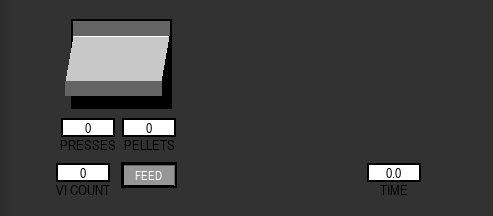

# Creating a new task

In the following tutorial, we will show all the basic features that need to be programmed to build a Task from scratch
in pybehave. 

## Task overview

For this tutorial, we will be programming a simple bar press task. This task will take place in an operant chamber where
the animal is able to press a lever to receive a pellet. When running this task, we need to handle two levels of difficulty:
an easy task where the every press produces a reward and a hard task where no rewards will be provided for a variable period 
for subsequent presses after a reward. In our lab, this Task has historically been used with hardware from Lafayette Instruments.
Hardware from other manufacturers might not have/require all the features we describe in the tutorial.

To start, create a new file in the `Local/Tasks` folder named BarPress.py

## Imports

We will be using the following imports in the process of developing this Task:

    from enum import Enum
    import random
    from pybehave.Components.BinaryInput import BinaryInput
    from pybehave.Components.Toggle import Toggle
    from pybehave.Components.TimedToggle import TimedToggle
    from pybehave.Components.Video import Video
    from pybehave.Events import PybEvents
    from pybehave.Tasks.Task import Task

## Subclassing

Tasks, like most features of pybehave, are objects. All Tasks extend the base Task class which handles most of the lower-level
behavior while exposing simpler methods to the user. Tasks can also override other Tasks rather than the base class if there
is a considerable degree of preserved behavior. For this tutorial, we are entirely building a Task from scratch so will be extending
the base class:

    class BarPress(Task):
        """@DynamicAttrs"""

## States

All Tasks have States which represent different phases of the Task where the Components the subject interacts with might have
different behaviors. For our BarPress Task, there are two states: one where pressing the lever produces a reward and a second 
where it does not. We can create an enum to represent these states with the following code segment:

    class States(Enum):
        REWARD_AVAILABLE = 0
        REWARD_UNAVAILABLE = 1

The names given for each state in this enum will become relevant later when we need to program the behavior for each State.

## get_components

All Tasks have physical Components which a subject can interact with. We will declare the Components available to the Task
by overriding the `get_components` method. For our BarPress Task, we have a lever to press for rewards, a light in the chamber,
a dispenser for food, a fan for white noise, a motor to enable the lever, a light over the lever, and a camera in the chamber.
All of these physical Components are represented in pybehave as implementation independent Component abstractions. Components
that have distinct on and off states like lights or motors are represented with Toggles. Components like the food dispenser that
should only be active for brief periods are represented with TimedToggles. On/off inputs are represented by BinaryInputs. Complex video-related
components like the camera are represented by Videos. To associate all of these Components with the Task, we must have `get_components`
return a dictionary linking the name we want to give each of these components to a list of Components it represents. In this Task,
all these lists will only have one element but if we had multiple levers we could group related Components together. The keys in 
the dictionary returned by `get_components` will automatically be added as attributes of the class with a single Component
(for a one element list) or list of Components as the value. The override for the example task is shown below:

    @staticmethod
    def get_components():
        return {
        'food_lever': [BinaryInput],
        'cage_light': [Toggle],
        'food': [TimedToggle],
        'fan': [Toggle],
        'lever_out': [Toggle],
        'food_light': [Toggle],
        'cam': [Video]
    }

## get_constants

All Tasks have certain constants that are set to define their behavior. These can include simple factors like the duration
or more complex indicators that flag how inputs from Components should be processed. For our BarPress example, we have 
constants for the Task's duration, the time the motor should be active to dispense a reward, an indicator for whether we want 
to lockout rewards for a period after a successful press, and minimum and maximum durations on the random lockout. To provide 
names for these constants and their default values, we override the `get_constants` method a dictionary with these name-value
pairs. The keys in the dictionary returned by `get_constants` will automatically be added as attributes of the class with the
corresponding initial value. The override for the example task is shown below:

    @staticmethod
    def get_constants():
        return {
            'duration': 40,
            'reward_lockout': False,
            'reward_lockout_min': 25,
            'reward_lockout_max': 35,
            'dispense_time': 0.7
        }

## init_state

All Tasks begin in an initial State which is indicated by overriding the `init_state` method. This State can depend on 
constants but for the case of our simple Task, this will just return the state where the reward is available:

    def init_state(self):
        return self.States.REWARD_AVAILABLE

## start

We often need to have certain behaviors begin right when the Task is started like lights or fans turning on. We can implement
this functionality by overriding the `start` method. This method can also be used to start timers that need to run for the duration
of the Task. The example override for the BarPress `start` method is below:

    def start(self):
        self.set_timeout("task_complete", self.duration * 60, end_with_state=False)
        self.cage_light.toggle(True)
        self.cam.start()
        self.fan.toggle(True)
        self.lever_out.toggle(True)
        self.food_light.toggle(True)

## stop

Similarly, we may need to have the opposite behaviors occur right when the Task ends. We can implement this functionality 
by overriding the `stop` method. The example override for the BarPress `stop` method is below:

    def stop(self):
        self.food_light.toggle(False)
        self.cage_light.toggle(False)
        self.fan.toggle(False)
        self.lever_out.toggle(False)
        self.cam.stop()

## all_states

Now that we've defined all the setup behavior, we need to implement what happens in each state. In many tasks, there might be
behavior that should occur regardless of the state the Task is in. This can be implemented using the `all_states` method. Two
common examples of cross-task behavior are handling the completion timeout or GUI inputs. The example override the BarPress
task is shown below:

    def all_states(self, event: PybEvents.PybEvent) -> bool:
        if isinstance(event, PybEvents.TimeoutEvent) and event.name == "task_complete":
            self.complete = True
            return True
        elif isinstance(event, PybEvents.GUIEvent) and event.name == "GUI_PELLET":
            self.food.toggle(self.dispense_time)
            return True
        return False

## State methods

Each state we defined earlier needs a method to define the behavior in response to events. In the REWARD_AVAILABLE state,
we need to deliver a reward whenever the lever is pressed. Additionally, if we need to lockout rewards after a press, we'll have 
to change the state. The only event we have to handle to implement this behavior is a ComponentChangedEvent:

    def REWARD_AVAILABLE(self, event: PybEvents.PybEvent):
        if isinstance(event, PybEvents.ComponentChangedEvent) and event.comp == self.food_lever and event.comp.state:
            self.food.toggle(self.dispense_time)
            if self.reward_lockout:
                self.change_state(self.States.REWARD_UNAVAILABLE)

For the REWARD_UNAVAILABLE state we need to handle two events: a StateEnterEvent where we will start a timer for when the lockout ends 
and a TimeoutEvent to change to the REWARD_AVAILABLE state when the time has elapsed:

    def REWARD_UNAVAILABLE(self, event: PybEvents.PybEvent):
        if isinstance(event, PybEvents.StateEnterEvent):
            self.set_timeout("lockout", self.reward_lockout_min + random.random() * (self.reward_lockout_max - self.reward_lockout_min))
        elif isinstance(event, PybEvents.TimeoutEvent) and event.name == "lockout":
            self.change_state(self.States.REWARD_AVAILABLE)

## Task GUI

All pybehave Tasks require a companion GUI file. If you have no need for visualizing any elements of the task, this file only
needs to contain a single class TaskNameGUI extending GUI that has an empty override for the `initialize` method. However, 
generally having some visual means of keeping track of task is very useful for efficiently and accurately running an experiment.
In this section of the tutorial, we'll walk through creating the GUI for the BarPress task.

### Imports

We will be using the following imports:

    from enum import Enum
    import math
    
    from pybehave.Elements.BarPressElement import BarPressElement
    from pybehave.Elements.ButtonElement import ButtonElement
    from pybehave.Elements.InfoBoxElement import InfoBoxElement
    from pybehave.Events import PybEvents
    from pybehave.GUIs.GUI import GUI

### Subclassing

All GUIs must extend the base GUI class which handles most of the lower-level behavior while exposing simpler methods to the user. 
GUIs can also override other GUIs rather than the base class if there is a considerable degree of preserved behavior or visuals. 
For this tutorial, we are entirely building a GUI from scratch so will be extending the base class:

    class BarPressGUI(GUI):
        """@DynamicAttrs"""

### Events

Sometimes GUIs are used to provide input from the experimenter running the task. To handle this type of behavior, add an Events
enum with an entry for each type of user interaction you expect. For the BarPress task, the only example of this we could handle
would be manually providing a reward:

    class Events(Enum):
        GUI_PELLET = 0

The names given for each Event in this enum are used in the original Task file (refer to the `all_states` method from earlier.)

### initialize

The `intialize` method instantiates all the elements in the GUI. Elements are the visual units that represent events and components
during the task. For our BarPress task, we will be adding a variety of Elements: a BarPressElement representing the lever,
a ButtonElement to handle the experimenter manual feed input, an InfoBoxElement tracking the total press count, an InfoBoxElement
tracking the total number of received rewards, an InfoBoxElement tracking the total time the task has been running, and an 
InfoBoxElement tracking the time until the bar will be available next. Different Elements require varying inputs to position
and configure them which can be seen in detail on the corresponding [documentation page](../guis.md). All the Elements created
in this method should be returned as a list. The full method declaration and the resultant GUI are shown below:

    def initialize(self):
        self.lever = BarPressElement(self, 77, 25, 100, 90, comp=self.food_lever)
        self.feed_button = ButtonElement(self, 129, 170, 50, 20, "FEED")
        self.feed_button.mouse_up = lambda _: self.log_gui_event(self.Events.GUI_PELLET)
        self.presses = InfoBoxElement(self, 69, 125, 50, 15, "PRESSES", 'BOTTOM', ['0'])
        self.pellets = InfoBoxElement(self, 129, 125, 50, 15, "PELLETS", 'BOTTOM', ['0'])
        self.time_in_task = InfoBoxElement(self, 372, 170, 50, 15, "TIME", 'BOTTOM', ['0'])
        self.vic = InfoBoxElement(self, 64, 170, 50, 15, "VI COUNT", 'BOTTOM', ['0'])

        return [self.lever, self.feed_button, self.presses, self.pellets, self.time_in_task, self.vic]

### handle_event

Since the Task GUI runs in a separate process from the Task itself, it will have to handle events sent from the Task to visualize
progression. The Task GUI has copies of all the component, constant, and variable attributes that were created in the actual Task file.
States for Components are automatically updated via the event stream but variables must be manually changed according to Task
behavior if they are needed for visualization. Every override of the `handle_event` method must begin by calling the super class
method:

    def handle_event(self, event: PybEvents.PybEvent) -> None:
        super(BarPressGUI, self).handle_event(event)

Some visualizations are state or event independent like the time that has elapsed since the task began:

    self.time_in_task.set_text(str(round(self.time_elapsed / 60, 2)))

However, most visualization in the GUi depend on a certain type of event or state. For example, to increment the pellet counter
we would need to handle a ComponentUpdateEvent where the component ID corresponds to the pellet dispenser and it moves into the
active state:

    if isinstance(event, PybEvents.ComponentUpdateEvent) and event.comp_id == self.food.id and event.value:
            self.food.count += 1
            self.pellets.set_text(str(self.food.count))

We can handle the lever press information in a similar manner:

    elif isinstance(event, PybEvents.ComponentUpdateEvent) and event.comp_id == self.food_lever.id and event.value:
            self.presses += 1
            self.presses.set_text(str(self.presses))

Sometimes metadata information from the Task might be needed/useful for visualization in the GUI. For example, to reflect the
random lockout time, we would need to save some metadata received during a StateEnterEvent:

    elif isinstance(event, PybEvents.StateEnterEvent) and event.name == "REWARD_UNAVAILABLE":
            self.lockout = event.metadata['lockout']

This variable can then be used to update the corresponding InfoBoxElement, whenever the Task is in the appropriate state:

    if self.state == "REWARD_UNAVAILABLE":
        self.vic.set_text([str(max([0, math.ceil(self.lockout - self.time_in_state)]))])
    else:
        self.vic.set_text("0")