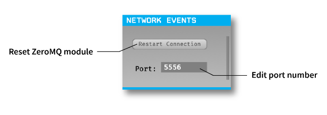
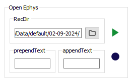
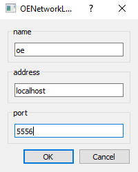
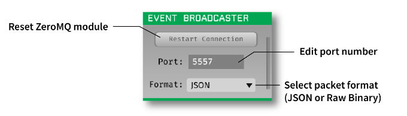
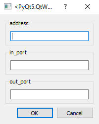

# Synchronizing with OpenEphys

Data from animal experiments often needs to be synchronized with external hardware or software. Traditionally, this is achieved
through TTL pulses from connected DAQs or serial communication. In addition to these options, pybehave provides two extensions 
for event synchronization specifically with the OpenEphys system: the OEWidget, OENetworkLogger, and OESource.

## OpenEphys Network Events

OpenEphys provides an interface through the 'Network Events' plugin to receive strings of data over a network connection.
These strings will be saved in a companion file along with timestamps synchronized to the data stream. This plugin also 
allows for control of the acquisition and record functionality via structured commands sent over the network.

## OEWidget

The OEWidget enables control of the acquisition and record functionality in OpenEphys directly from the pybehave GUI. 
To make a connection, this widget requires the network address to OpenEphys and the port that's being used in the connection.

If OpenEphys is running on the same computer as pybehave then the address is 'localhost'. Otherwise, the address is the IP
of the computer running OpenEphys. The port number is configured in the OpenEphys 'NetworkEvents' plugin and defaults to 5556.

The widget allows for configuring a few aspects of the acquisition process. Firstly, it will default to saving any recorded
data and events in the same directory as the rest of the pybehave data for the subject. This path will automatically update if the subject
is changed. Secondly, additional text can be added to the recording name through the prependText and appendText fields. Thirdly,
the acquisition can be stopped and started from the top play button while the recording can be stopped and started from the bottom
circular button.

## OENetworkLogger

The OENetworkLogger automatically forwards all Loggable pybehave events to the OpenEphys events stream as strings. These
strings are identical to the rows in the default pybehave output file but will be additionally saved in the OpenEphys event
framework along with corresponding timestamps. It should be noted that for the current version of OpenEphys, only one event 
will be recorded in OpenEphys if multiple events fall on the same sample. The OENetworkLogger requires the same information
to set up as the OEWidget.

## OESource

The OESource allows for bidirectional communication between OpenEphys and pybehave and is primarily intended for directly
interacting with the OpenEphys data stream or using OpenEphys events to control pybehave components. Writing via this source
requires a 'NetworkEvents' plugin in the OpenEphys signal chain and allows a user to send TTL commands to the OpenEphys data
stream via pybehave components. To receive data from OpenEphys, an 'EventBroadcaster' plugin also needs to be added to the
signal chain.

This plugin should use a different port from the 'NetworkEvents' plugin (it defaults to 5557) and should be set to send 
in JSON format. To handle these events in pybehave, we recommend using the existing OEBinaryInput component which has a 
few configuration options to handle the various types of TTL events.

The OESource requires the OpenEphys network address (like in the OEWidget and OENetworkLogger), the input port from the
'NetworkEvents' plugin, and the output port from the 'EventBroadcaster' plugin.

