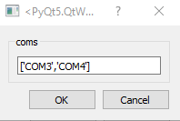

# Setting up OSCAR with pybehave


The [Open Source Controller for Animal Research (OSCAR)](https://github.com/tne-lab/OSCAR) is a device developed by the TNEL
to control operant chambers similarly to industry systems at a fraction of the cost. OSCAR can readily be integrated with pybehave
by configuring a task to use the OSControllerSource.

## Setting up the source

Before adding the source to pybehave, you need to determine which serial COM ports OSCAR is using to communicate with the 
host computer. On Windows, this can be done by opening the Device Manager and examining the Ports dropdown. 


If you have many serial devices connected to the same computer, we recommend unplugging each OSCAR separately and seeing 
which serial device (and corresponding COM ID) is removed from the dropdown.

With the list of COM IDs in hand you can now add the OSControllerSource to pybehave. To do this, go to File->Settings and
press the "+" button to add a new Source. In the resultant dialog, choose whatever name you want to use to refer to the 
source ("oscar" in the example) and select the OSControllerSource from the dropdown.


After pressing OK, a second dialog will pop-up in which you should enter the list of COM IDs you identified earlier. The
example below shows how you'd configure the source for two OSCARs:



After pressing OK once again, if the dialogs close without raising an error then you have successfully linked pybehave to
your OSCAR interfaces.

## Creating AddressFiles for OSCAR components

Addresses for OSCAR components are formatted as follows:

    {OSCAR Index}_{A, O, or blank}{Controller Address}

The first part of the address corresponds to the index of the OSCAR this component is associated with. Each OSCAR is assigned
an index based on the order of the COM IDs provided when creating the OSControllerSource. In the above example, the OSCAR 
associated with COM3 would have an index of 0 while the one associated with COM4 would have an index of 1.

The second part of the address is only required if you are connecting a component to the GPIO or analog output terminals.
To configure a GPIO component, add an 'A' character to the address. The OSControllerSource will automatically configure 
the OSCAR GPIO pins to use a digital output, digital input, or analog input depending on the component type. To configure
an analog output component, add an 'O' character to the address.

To communicate with hardware, OSCAR breaks out the outputs and inputs from the underlying Arduino to an application-specific
environment connection board (ECB), the GPIO terminals, or the analog output terminals. The correspondence between the Arduino 
pins (and their controller addresses) to the physical connections on the ECB is entirely up to the creator of the ECB. As a result, 
the specific OSCAR addresses you will need to link to the components will depend on the specific ECB you're using. 

In the TNEL, we originally designed OSCAR to work with Coulbourn hardware and the corresponding Coulbourn ECB. We've included a 
[table](https://github.com/tne-lab/OSCAR/blob/main/ECB/Coulbourn/CoulbournAddresses.csv) in the OSCAR GitHub repository 
that links the hardware connection on the ECB to the corresponding controller address. For example, if a Toggle was connected
to the HouseLight slot on the ECB connected to output A, this would require a controller address of '8'. Putting the parts 
together, the full address for this component would be

    0_8

If instead a component was wired to the GPIO terminals, the address would correspond to the pin used (0-3, left-right. For
example, if the component was connected to the third column of the GPIO terminal the full address would be

    0_A2

Similarly, if a component was wired to the analog output terminals on the third column, the full address would be

    0_O2

## Citing OSCAR

If you use OSCAR, please cite the preprint hosted on biorxiv:

```
@article {Dastin-van Rijn2023.02.03.527033, author = {Evan M. Dastin-van Rijn and Elizabeth Sachse and Francesca Iacobucci and Megan Mensinger and Alik S. Widge}, title = {OSCAR: an open-source controller for animal research}, elocation-id = {2023.02.03.527033}, year = {2023}, doi = {10.1101/2023.02.03.527033}, publisher = {Cold Spring Harbor Laboratory}, abstract = {Operant animal behavior training and monitoring is fundamental to scientific inquiry across fields necessitating evaluation via controlled laboratory tasks. However, current commercial and open-source systems enforce particular hardware and software, limiting reproducibility and technique and data sharing across sites. To address this issue, we developed OSCAR: an open-source controller for animal research that enables flexible control of a variety of industry standard hardware with platform-independent software. OSCAR offers millisecond latency with a flexible array of inputs and outputs at a fraction of the cost of commercial options. These features position OSCAR as a valuable option for improving consistency of behavioral experiments across studies.Competing Interest StatementThe authors have declared no competing interest.}, URL = {https://www.biorxiv.org/content/early/2023/02/04/2023.02.03.527033}, eprint = {https://www.biorxiv.org/content/early/2023/02/04/2023.02.03.527033.full.pdf}, journal = {bioRxiv}}
```