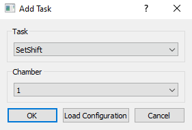
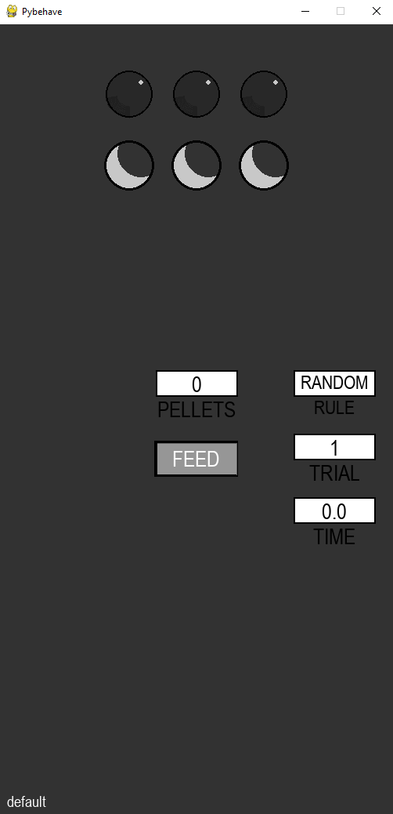
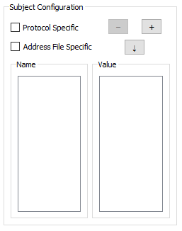
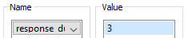

# Testing a task without hardware

In the following tutorial, we will show some examples of how to run and test a task without any external hardware. This 
functionality is integral to the hardware-independent framework pybehave runs on and especially useful for rapidly prototyping
new tasks and features. This is not a complete overview of all possible options for testing and developing tasks but will
give some examples of the GUI features available for simulated user inputs and a method to directly simulate Sources.

## Example task

For this tutorial we will be setting up the Workstation to run an operant [extradimensional set-shifting task](https://www.biorxiv.org/content/10.1101/2024.02.16.580680v2). In this task,
the agent must select between ports on the left and right sides of the environment to receive rewards. Rewards will be given
based on correctly performing the active rule: a light rule where the illuminated option is always correct and a side rule 
where a particular side is always correct. After a prescribed number of correct trials in a row, the rule will change without
the agent being notified. Trials can be initiated following a brief intertrial interval by selecting the middle port.

The code for this task and other parts of this tutorial are available in the [examples repository](https://github.com/tne-lab/example-tasks/blob/main/Tasks/SetShift.py).
This version of set-shift also has video and stimulation integration but these features are not integral to how the task works.

## Adding the task to the Workstation

To run a Task, it needs to be associated with one of the Workstation's chambers. This can be done
by going to File->Add Task to open the corresponding dialog.

The desired task can be selected from the dropdown along with the chamber it should be associated
with. When the task is selected, the task-specific GUI will appear in the pygame interface.

## Walking through control with the task GUI

The set-shift GUI has a number of [Elements](../guis.md#elements) for both task visualization and control. The first row 
of circles indicates the illumination of each of the three ports. Elements like these are typically associated with Toggles
to communicate to the user whether a light or similar element is active. The illumination of these Elements will change throughout
the task but can also be manually toggled by clicking on them. This functionality is not particularly useful without hardware
but could be leveraged to allow user control of hardware from the GUI if connected. The second row indicates the selection status
of each port. When a port is selected, a triangle will appear over the corresponding Element. By clicking on these Elements,
a user can directly provide input events to the task from the GUI as if there was actual hardware.

The white boxes in the GUI solely provide information on the current task state. These will update as the task progresses
and could be used to validate responses from the agent interacting with the hardware or the GUI itself. Lastly, the gray 
Element is a button that can be pressed in the GUI to activate the reward dispenser. Features like this are useful to provide
explicit control of the task by the monitoring user.

During testing, [AddressFiles](../protocols_addressfiles.md#addressfiles) could be used to connect some Components in the 
task to hardware while having others only be controlled from the GUI. An example of how to make an AddressFile is included
in the [hardware tutorial](task_on_hardware.md#creating-a-protocol).

## SubjectConfiguration for rapidly changing constants

Typically, task constants should be configured using standardized [Protocols](../protocols_addressfiles.md#protocols) to 
build consistent variants of a task. An example of this approach is shown in the [hardware tutorial](task_on_hardware.md#creating-a-protocol).
However, there is a useful alternative that can be especially helpful during prototyping/development: the [SubjectConfigWidget](../workstation.md#subjectconfigwidget).
The SubjectConfigWidget allows for setting constant values that will be uniquely associated with each subject. This can also
be used to change constant values in between runs of the Task during testing. To use the widget, right-click the ChamberWidget
and select *Edit Configuration*. From here, select the plus/add button in the Widget section and add a SubjectConfigWidget.

From here, constants can be added for configuration by pressing the plus/add button which will add a row to the configuration
with a dropdown for the constant and a field for its value (the constant will be pre-populated with the valid entries in the
task's `get_constants` method).

Values for a particular subject can be saved to load every time this subject runs the task by pressing the down-arrow button.
Subject specific configuration can also be made to differ per Protocol or AddressFile but this feature is less useful for
task testing and more for streamlining experiments. Constants can also be updated while a task is running and will log 
ConstantUpdateEvents which can be analyzed offline or handled in Task code. Generally, this real-time feature is more intended
for development than as an actual part of the task workflow since constants are meant to have fixed values. Instead, elements
can be added to the GUI to update task variables if user input is required while the task is running.

## Simulating sources

While in most cases it is sufficient to test a task using the GUI itself, there are cases where a user might want to virtualize
inputs to the task from a software source. This can be especially helpful to test task functionality that depends on specific 
timing or strategies that would be difficult for a user to mimic. In the example repository, we have provided a [SetShiftSimSource](https://github.com/tne-lab/example-tasks/blob/main/Sources/SetShiftSimSource.py)
that virtualizes inputs to the task according to a reinforcement learning algorithm with a fixed learning rate and softmax
choice function. Additionally, initiation delay, performance, and reaction time are configured to be sensitive to the values of
the stimulation parameters. The example given is only designed to work with a single task at a time.

Building a simulated source like this is an advanced feature and requires some knowledge of the backend of pybehave. Since 
this is effectively the same as building a new hardware source, we recommend reading the tutorial for [Creating a New Source](creating_source.md)
and the general Sources [documentation](../sources.md) first. One major difference between simulated sources like these and
standard sources is that simulated sources are designed to work with particular tasks not particular hardware. As a result,
they will need to track when certain components are activated or changed whereas the exact names/IDs of components are not 
generally important for standard sources. For example, when the task toggles the middle port on, the simulated source should
respond be selecting the middle port with a prescribed delay. When the light is toggled, the `write_component` of the simulated
source will be called. However, this method is called when any component is written to. To respond specifically to the light, 
we'll need to validate the ID. In the pybehave backend, component IDs have the following format:

    {component_name}-{chamber_number}-{component_index}

Therefore, in the simulated source we could determine that the middle port light is being turned on with the following line:

    if component_id.startswith('nose_poke_lights-' + str(self.component_chambers[component_id]) + '-1') and msg:

where `component_chambers` is a field that links the component ID to the chamber it comes from. 

To have behavior execute after a prescribed amount of time we use the pybehave [TimeoutManager](https://github.com/tne-lab/py-behav-box-v2/blob/master/pybehave/Tasks/TimeoutManager.py) class.
For example, if we wanted to send an input event to the second port in 2 seconds, we could use the line below:

    self.tm.add_timeout(Timeout('timeout_name', self.component_chambers[component_id], 2, self.update_component, ('nose_pokes-' + str(self.component_chambers[component_id]) + '-1', True)))

The SetShiftSimSource has a number of examples using the approaches above which should be sufficient for simulating most task
behavior.