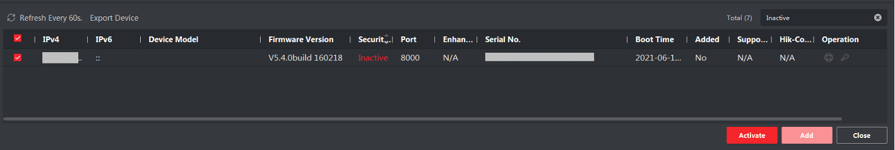

# Synchronizing with video data

Data from animal experiments often needs to be synchronized with concurrent video recordings. Typically, video systems are 
run through separate software than the behavioral task and must be synchronized through visual information (timed lights)
or injected TTL events for higher end systems. In pybehave, we implemented sources that can directly control video acquisition
concurrently with task code to simplify video synchronization and serialization.

## Video component

Tasks with concurrent video feeds need to add a Video component. By default, the Video component has limited functionality 
and only provides methods to signal that a recording should start and stop and an attribute to provide a name. If no name is
provided for the video, it will default to the current time in seconds. To provide more complex functionality, sources that
interact with Video components expect additional metadata.

## VideoSource

The general purpose VideoSource is likely the go-to option for most users when synchronizing video. This source provides 
a general framework for displaying and serializing video feeds with specific implementations for various feed types. Currently,
this source only supports webcams and Imaging Source cameras but more will likely be added in the future. 
If you are interested in adding video feeds from non-implemented systems, simply override the abstract VideoProvider
class and take the existing options as examples.

The VideoSource can support an arbitrary number of camera feeds which will be displayed in a grid in a companion GUI. To set up the source,
users will have to specify the size of the GUI and the dimensions of the grid.

To use Video components with the source, a few additional pieces of metadata will need to be provided with the Video in the
AddressFile: which row 'row' and column 'col' in the grid the video should be placed in, how many rows 'row_span' and how many
additional columns 'col_span' the video will take up in the grid (0 for a single cell), and the desired frame rate 'fr'. 
The video will be saved at whatever framerate is specified even if the underlying video provider is generating frames faster 
or slower (frames will be skipped or duplicated). This is done to ensure the video will exactly match the time elapsed between 
when it was started and stopped. If you want to use a VideoProvider other than the webcam, you will also need to add a 'vid_type'
key-value pair. Currently, the following provider designations are supported:

    webcam: WebcamProvider (default)
    imaging_source: ImagingSourceProvider
    

### Identifying the video feed address

VideoProviders require different formats for the addresses of the corresponding video feeds. 

#### Webcams

We use OpenCV to implement video capture with webcams. OpenCV assigns each camera connected to the computer an index with 
the system default camera having index '0'. This index should be used as the address when declaring the pybehave component.
OpenCV has no consistent system for assigning indices to cameras, so we recommend trying every index beginning from '0' if 
you have multiple cameras connected to the system and want to identify the correct one.

An example AddressFile line for a webcam is shown below:

    addresses.add_component("cam", "Video", "vs", "0", None, {"fr":30,"row":0,"col":0, "col_span":0,"row_span":0})

#### Imaging Source

[The Imaging Source](https://www.theimagingsource.com/en-us/) manufactures high-end industrial cameras that have been used
in some animal research applications. Using their provided [API](https://github.com/TheImagingSource/IC-Imaging-Control-Samples/tree/master/Python), 
we've integrated acquisition from Imaging Source cameras into the pybehave VideoSource framework. When using these cameras,
the address is full serial number for the corresponding camera. 

An example AddressFile line for an Imagine Source camera is shown below:

    addresses.add_component("cam", "Video", "vs", "DFK Z30GP031 41910044", None, {"fr":30,"row":0,"col":0, "col_span":0,"row_span":0,"vid_type":"imaging_source"})

## HikVisionSource

One option that the TNEL has had a lot of success with is using traditional security system (DVR) hardware to manage our
video recordings. These systems are very reliable, support many feeds, and are far less expensive than traditional researcher-facing
tools. In particular, we use HikVision DVRs because they have a well documented and robust API for controlling recordings
over the local network.

### Setup

After following the DVR's own manual to set up the hardware you will need to link it to the HikVisionSource in pybehave.
This requires three pieces of information: the DVR IP, the admin username, and the admin password. The easiest way to find
the IP is via the free [iVMS-4200](https://www.hikvision.com/us-en/support/download/software/ivms4200-series/) software tool.
Relatedly, because this software exists, the HikVisionSource does not directly visualize the feeds, and we encourage users to use the 
existing streaming service in the tool. To identify the IP, enter the Device Management page and click Device on the top 
of the right panel. From here, click Online Devices to show the online device list at the bottom of the page. 

Add the device that corresponds to your DVR using the username and password you configured during set up. If this device
is added successfully, the IP you need for linking to pybehave will be shown in the IPv4 column.

With these three pieces of information, you should be able to copy them to the corresponding fields in the HikVisionSource
creation dialog:

### Addresses

Addresses for HikVision BNC cameras are split into two parts: the channel number and the stream type. The channel number 
corresponds to the location the camera was physically plugged into the DVR. The stream type will either be '01' for the 
main stream or '02' for the substream. 

An example AddressFile line for a HikVision BNC camera plugged into the third input is shown below:

    addresses.add_component('video', 'Video', 'hvs', '301')

### Additional notes

When a recording is started, a small black overlay will be added in the bottom left corner of the video as a sync marker.
Currently, this is a fixed size and remains active for the duration of the recording, but it could feasibly be varied or 
intermittent to handle task events. We use this marker to denote the time when the task started since the DVR feed will begin
a few seconds before the recording start event is received. Once the recording is stopped, the video will be automatically 
downloaded in a separate thread to the subject data folder.