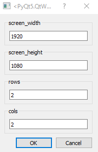
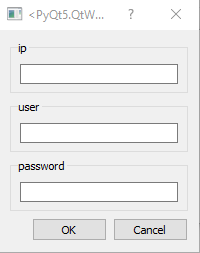

# Synchronizing with video data

Data from animal experiments often needs to be synchronized with concurrent video recordings. Typically, video systems are 
run through separate software than the behavioral task and must be synchronized through visual information (timed lights)
or injected TTL events for higher end systems. In pybehave, we implemented sources that can directly control video acquisition
concurrently with task code to simplify video synchronization and serialization.

## Video component

Tasks with concurrent video feeds need to add a Video component. By default, the Video component has limited functionality 
and only provides methods to signal that a recording should start and stop and an attribute to provide a name. If no name is
provided for the video, it will default to the current time in seconds. To provide more complex functionality, sources that
interact with Video components expect additional metadata.

## VideoSource

The general purpose VideoSource is likely the go-to option for most users when synchronizing video. This source provides 
a general framework for displaying and serializing video feeds with specific implementations for various feed types. Currently,
this source only supports webcams and ImagingSource cameras but more will likely be added in the future. Webcams use the 
camera index as their address while ImagingSource cameras have a more complex format that is described in detail in their 
documentation. If you are interested in adding video feeds from non-implemented systems, simply override the abstract VideoProvider
class and take the existing options as examples.

The VideoSource can support an arbitrary number of camera feeds which will be displayed in a grid in a companion GUI. To set up the source,
users will have to specify the size of the GUI and the dimensions of the grid.

To use Video components with the source, a few additional pieces of metadata will need to be provided with the Video in the
AddressFile: which row 'row' and column 'col' in the grid the video should be placed in, how many rows 'row_span' and how many
additional columns 'col_span' the video will take up in the grid (0 for a single cell), and the desired frame rate 'fr'. 
The video will be saved at whatever framerate is specified even if the underlying video provider is generating frames faster 
or slower (frames will be skipped or duplicated). This is done to ensure the video will exactly match the time elapsed between 
when it was started and stopped. An example AddressFile line for a webcam is shown below:

    addresses.add_component("cam", "Video", "vs", "0", None, {"fr":30,"row":0,"col":0, "col_span":0,"row_span":0})

## HikVisionSource

One option that the TNE lab has had a lot of success with is using traditional security system (DVR) hardware to manage out
video recordings. These systems are very reliable, support many feeds, and are far less expensive than traditional researcher-facing
tools. In particular, we use HikVision DVRs because they have a well documented and robust API for controlling recordings
over the local network. 

To set up the HikVisionSource, you will need to provide the IP of the device (this can be found from their companion software)
and the username and password for the DVR.

An example AddressFile line for a HikVision BNC camera is shown below:

When a recording is started, a small back overlay will be added in the bottom left corner of the video as a sync marker.
Currently, this is a fixed size and remains active for the duration of the recording, but it could feasibly be varied or 
intermittent to handle task events. We use this marker to denote the time when the task started since the DVR feed will begin
a few seconds before the recording start event is received. Once the recording is stopped, the video will be automatically 
downloaded in a separate thread to the subject data folder.