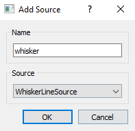

# Running tasks with the pybehave Workstation

## Overview

The Workstation GUI is responsible for controlling all user interactions with [Tasks](). The interface presents all the necessary
controls for running tasks, configuring [Sources]() and [EventLoggers](), and visualizing behavior in real-time. Most configuration
is accessible from the menu bar while Tasks are controlled via *ChamberWidgets*.

## Adding a Task

To add a new Task to the Workstation, select *File->Add Task* from the menu bar. This will produce the following pop-up:

The *Task* dropdown allows for selection of which Task should be added. The list of tasks in generated based on the module 
names in the *source/Tasks* folder. The *Chamber* dropdown indicates what index the Workstation should associate the Task with.
The number of chambers the Workstation supports is configurable and is described further [below](#workstation-settings). Once the desired values
have been selected from the dropdowns, the task can be added by clicking *OK*. Alternatively, the task can be loaded from a
[configuration file](#configurations) by clicking *Load Configuration*.

## ChamberWidgets

Each added task is associated with a *ChamberWidget* that provides all controls necessary for interacting with the task:

The number in the top-left indicates the chamber the task is associated with. The name/ID of the subject or participant can 
be indicated using the *Subject* textbox. The type of task currently loaded in this chamber is shown by the *Task* dropdown.
The user can load an [AddressFile](protocols_addressfiles.md) or [Protocol](protocols_addressfiles.md) by clicking the folder 
icons next to the corresponding fields which will bring up a file browser interface. Any data saved by the task using 
[EventLoggers]() or linked external systems will be saved in the folder indicated by *Output Folder*. This path defaults to the 
*Desktop/py-behav-box-v2/TASK_NAME/Data/SUBJECT_NAME/DATE* directory. The task can be started by clicking the green play button
which will transition to an orange pause button and enable the red stop button once begun. All events logged by the task will
appear in the textbox at the bottom of the widget. To clear the chamber, right-click the widget and select *Clear Chamber*
from the menu.

### Configurations

Configurations allow tasks, AddressFiles, Protocols, subjects, chambers, and other information to be associated to streamline
the process of adding tasks to the Workstation. The configuration for a given task can be saved by right-clicking the ChamberWidget
and selecting *Save Configuration* from the menu. This will create a file in the *Desktop/py-behav-box/v2/Configurations* folder
that can later be loaded while adding a task to repopulate all previously configured fields. Further aspects of the configuration
can be modified by right-clicking the ChamberWidget and selecting *Edit Configuration* which will produce the following pop-up:

Any text entered in the *Prompt* textbox will be included in an alert before the task begins. This can serve as a reminder 
to start any required programs/processes or turn on external hardware. The add and remove buttons at the bottom of the pop-up
allow for configuring [EventLoggers](). The add button will produce a pop-up to select the type of EventLogger:

Depending on the type of EventLogger, a further pop-up may be raised to configure other attributes. EventLoggers
in the dropdown are generated from the module names in *source/Events* that end in "EventLogger".

## Workstation Settings

Further settings for configuring the Workstation can be accessed from the menu bar by selecting *File->Settings* bringing 
up the following pop-up:

The number of chambers that can be controlled by this Workstation can be indicated by editing the *Chamber Count* textbox.
The list of sources indicating their names/IDs and types is shown in the *Sources* textbox.
The add and remove buttons at the bottom of the pop-up can be used to configure the Sources available to the Workstation.
The add button will produce a pop-up:

A name/ID for the source can be indicated by the *Name* textbox along with the *Source* type from the dropdown. Sources
in the dropdown are generated from the module names in *source/Sources*.